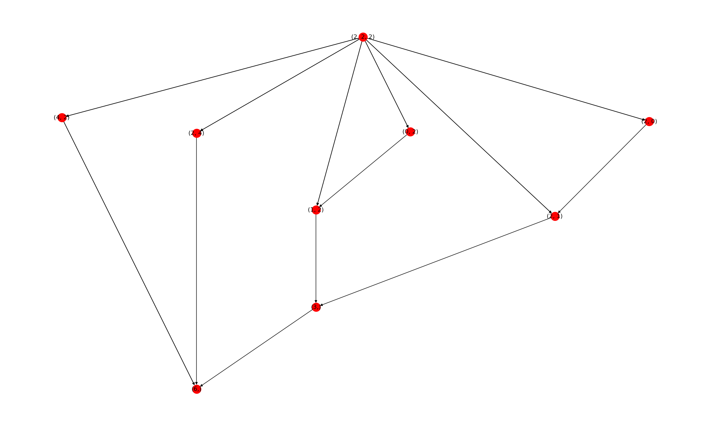
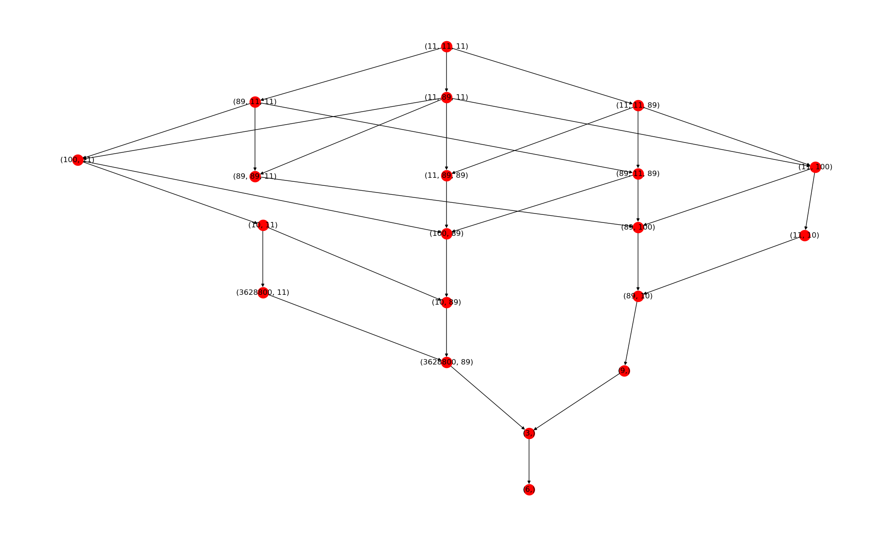
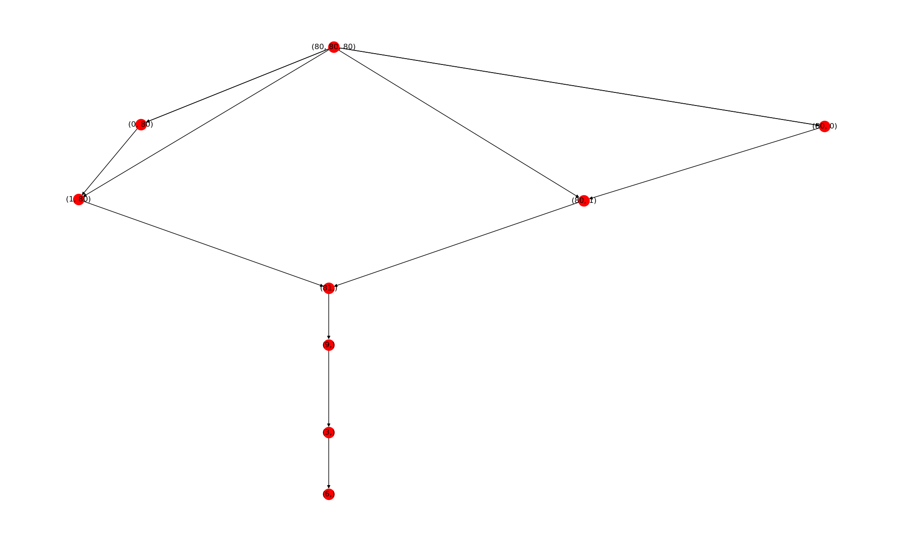

# 6s-challenge

# 6s-challenge

I found this math challenge on the web
https://mindyourdecisions.com/blog/2018/07/23/can-you-solve-the-6s-challenge/

You are given three time the number x (in [0,9]) and you are asked to add math operators 
between them so the resulting (valid) formula gives 6.

Ex: 2 2 2
One can obtains 6 from this doing the following $2+2+2 = 6$ or $((2-2)! + 2)!$



### Bruteforce

This gave me the idea to kind of bruteforce the solution. I came up with an efficient way of doing the computations (and **memoization**).

## Modules

As usual, I tried to play with an unknown Python module to learn how to us it. 
- `decorator`: add possibilities to default Python decorators, especially to wrap function signature (so it is not lost after the decoration). Discovered the possibility to add __annotation__ to functions

- `inspect` : inspect function signature at run-time 

I used this module to have a convenient way to add new operators to be used by the algorithm
Initially : add (+), minus (-), time ( * ), div /, factorial !, sqrt

### Decorator
```python
from decorator import decorator, decorate

@decorator
def tuplify(func, *args, **kwargs):
    return (func(*args, **kwargs),)


def register(func, *args, **kwargs):
    """Annotate the function as 'operator' for core module"""
    func.__annotations__['operator'] = True
    return decorate(func, lambda f, *args, **kwargs: f(*args, **kwargs))
```
### Inspect
```python
inspect.getfullargspec
inspect.isfunction
dir(module-or-filename) # Get all the function and attr of this file
```

### Conclusion

We can have 6 from 1 1 1 doing (1+1+1)!
Moreover, each 0 can be turned into 1 doing the following 0! = 1

Thus, if I add any strictly decreasing unary operator to the authorized math operators (such as Euler Totient function $\phi$), it is always possible to get 6 from any XYZ.

It was funnier to play with increasing unary function like $n : -> F_n$ the Fibonacci sequence.

I have this nice graph with the Fibonacci sequence:


Or without for 80 80 80


